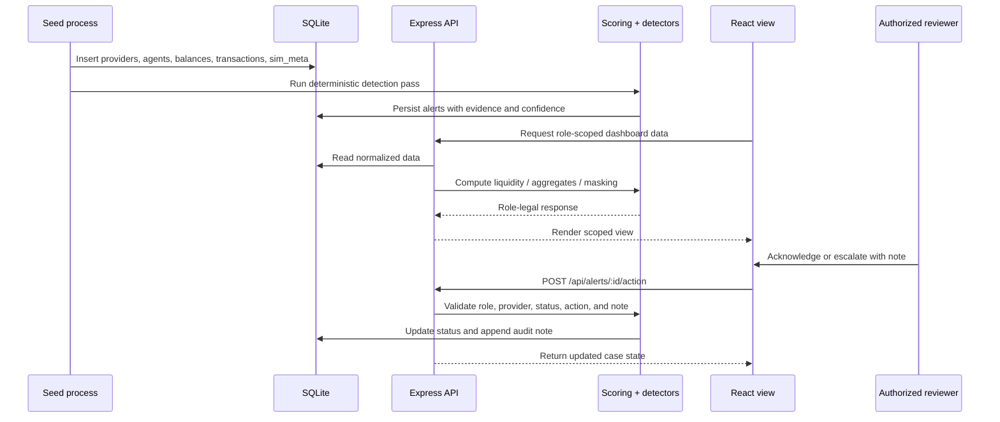
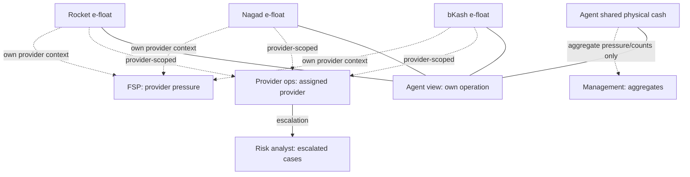
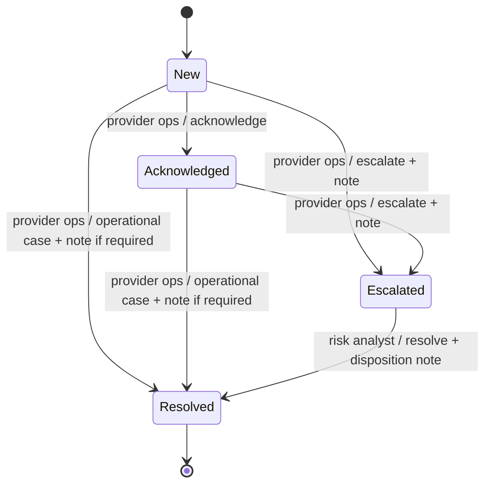

# Architecture Diagram Outline

CashLens is a local-first decision-support prototype for a multi-provider mobile-
money agent operation. It combines one shared physical-cash drawer with three
separate provider e-money balances without merging wallets or crossing provider
authority boundaries.

## 1. Architecture principles

1. **Relational source of truth**: normalized SQL tables hold providers, agents,
   provider balances, transactions, alerts, case notes, and simulation metadata.
2. **Synthetic by construction**: the seed process creates deterministic demo data;
   no real accounts, credentials, provider APIs, or customer identities are used.
3. **Server-enforced boundaries**: masking and allowed workflow actions are applied
   in the API and engine, not only hidden in React components.
4. **Separate money representations**: physical cash is one agent-level value;
   bKash, Nagad, and Rocket balances remain separate provider-level values.
5. **Human-in-the-loop risk handling**: analytics create evidence and suggestions;
   authorized people acknowledge, escalate, and resolve cases.
6. **Observable uncertainty**: stale, missing, inconsistent, or degraded feeds are
   represented explicitly and reduce confidence instead of becoming false certainty.

## 2. High-level component diagram

```mermaid
flowchart LR
  subgraph UI[React + Vite client]
    Landing[Landing / sign-in]
    Agent[Multi-provider agent view]
    Ops[Provider operations view]
    Risk[Risk / compliance view]
    FSP[Financial service provider view]
    Mgmt[Management view]
    Live[Live transaction feed]
    Scenarios[Guided scenarios]
    Theme[Theme + language controls]
  end

  subgraph API[Express API]
    Middleware[JSON, CORS, trace IDs, error boundary]
    AgentRoutes[/api/agents]
    AlertRoutes[/api/alerts]
    OverviewRoutes[/api/overview, /api/meta, /api/metrics]
    WhatIfRoutes[/api/whatif]
    LiveRoutes[/api/live-feed]
    HealthRoutes[/api/health, /api/ready, /api/observability]
  end

  subgraph ENGINE[Domain and analytics services]
    Liquidity[Liquidity scorer]
    Detectors[Alert detectors]
    Workflow[Authority and case workflow]
    Masking[Role/provider masking]
    Overview[Management aggregates]
    ScenarioEngine[Scenario target resolver]
    Stream[Live synthetic transaction stream]
    Advisor[Optional advisory service]
  end

  subgraph DATA[Relational data layer]
    SQLite[(SQLite relational database)]
    Seed[Deterministic seed + anomaly labels]
    Metrics[Validation metrics]
  end

  Landing --> Agent
  Landing --> Live
  Agent --> Scenarios
  UI --> Middleware
  Middleware --> AgentRoutes
  Middleware --> AlertRoutes
  Middleware --> OverviewRoutes
  Middleware --> WhatIfRoutes
  Middleware --> LiveRoutes
  Middleware --> HealthRoutes
  AgentRoutes --> Liquidity
  AgentRoutes --> Masking
  AlertRoutes --> Workflow
  AlertRoutes --> Masking
  OverviewRoutes --> Overview
  OverviewRoutes --> ScenarioEngine
  WhatIfRoutes --> Liquidity
  LiveRoutes --> Stream
  Liquidity --> SQLite
  Detectors --> SQLite
  Workflow --> SQLite
  Overview --> SQLite
  ScenarioEngine --> SQLite
  Seed --> SQLite
  Metrics --> SQLite
  Stream --> SQLite
  Stream -. optional aggregate advisory .-> Advisor
```

## 3. Authentication boundary

The landing page now authenticates a synthetic demo identity before opening
role-scoped workspaces. `POST /api/auth/login` verifies a salted scrypt password
hash, creates an expiring HttpOnly session cookie, and returns the user's display
name and scope. Protected API routers load the user from that session; they do not
trust role, provider, or agent values supplied in a URL.

```text
Landing login
    |
    v
POST /api/auth/login
    |
    +--> users.password_hash verification
    +--> sessions.token_hash + expiry
    +--> HttpOnly cashlens_session cookie
              |
              v
     requireAuth middleware
              |
              +--> role
              +--> provider scope
              +--> agent scope
```

The seeded demo identities are synthetic and all use the documented demo password.
This fixes the prototype's previous query-parameter role limitation while keeping
production requirements explicit: an external identity provider, MFA, rate
limiting, recovery, and a real password policy would still be required.

## 3. Main interfaces

| Interface | Primary user | Main responsibility | Sensitive data boundary |
|---|---|---|---|
| Landing / sign-in | Any demo participant | Authenticate a demo identity and open the live feed | Does not expose balances or cases |
| Multi-provider agent | Agent | View physical cash beside each provider float, pressure, alerts, and what-if projections | Own operation only; no control over another agent |
| Provider operations | Provider operations team | Review assigned-provider alerts and coordinate operational actions | Own provider details; cross-provider exact values are masked |
| Risk / compliance | Risk analyst | Review escalated evidence and record a disposition | Escalated/resolved cases only; final judgement is human |
| Financial service provider | Provider representative | View provider-specific service pressure and readiness | Own provider context; no other provider balances or authority |
| Management | FSP management | View aggregate readiness, hotspots, counts, and validation metrics | Counts and aggregates; no individual balances or case actions |
| Live transaction feed | Demo participant | Observe synthetic events, risk score, active alerts, and demo controls | Synthetic stream only; controls affect in-memory demo state |
| Guided scenarios | Multi-provider agent view | Open scenario A-D and deep-link to the exact supporting agent/case | Read-only navigation; no new authority |

The current UI uses the CashLens logo as the in-app return action to the landing
page. Changing the active user happens by signing out through the logo and signing
in with another landing-page identity rather than using a permanent sidebar. The application header retains view-appropriate utility controls such as
theme, language, and live-feed access.

## 4. Relational data model

```text
providers
  id PK
  name

agents
  id PK
  name
  area
  physical_cash
  scenario_tag       -- validation ground truth only; never user-facing

agent_provider_balances
  agent_id PK/FK -> agents.id
  provider_id PK/FK -> providers.id
  e_money_balance
  last_synced_at

transactions
  id PK
  agent_id FK -> agents.id
  provider_id FK -> providers.id
  type               -- cash_in or cash_out
  amount
  timestamp
  is_synthetic_anomaly
  anomaly_kind

alerts
  id PK
  agent_id FK -> agents.id
  provider_id nullable FK -> providers.id
  type               -- liquidity, imbalance, unusual transaction, data quality
  severity
  evidence_json
  confidence
  status             -- new, acknowledged, escalated, resolved
  assigned_role
  created_at
  source_transaction_id nullable FK -> transactions.id

case_notes
  id PK
  alert_id FK -> alerts.id
  role
  note
  timestamp

sim_meta
  key PK
  value
```

The composite primary key on `agent_provider_balances` prevents duplicate
provider snapshots for an agent. Foreign keys keep transactions, balances, alerts,
and notes attached to known entities. Indexes support agent/time transaction
queries, provider filtering, alert status queues, and agent alert views.

## 5. Runtime and data flow



### Detection flow

1. The seed process creates a reproducible baseline and deliberately labeled
   anomaly conditions.
2. `computeAgentLiquidity` reads physical cash, separate provider balances, and
   transaction history.
3. Detectors evaluate liquidity pressure, cross-provider imbalance, unusual
   transaction behavior, and feed/data quality.
4. `runDetection` persists evidence, severity, confidence, assignment, and source
   transaction references in `alerts`.
5. Labels such as `scenario_tag` and `is_synthetic_anomaly` are reserved for
   validation; detectors do not use them as decision inputs.

### Live-feed flow

1. The in-memory stream produces synthetic transactions and updated snapshots.
2. `GET /api/live-feed/stream` publishes Server-Sent Events to the client.
3. `GET /api/live-feed/snapshot` provides the current snapshot on page load.
4. Demo controls pause/resume the stream or inject synthetic drain/anomaly events.
5. No live-feed control calls a provider API or moves money.

## 6. Provider and role boundaries



The API applies these boundaries before serialization:

- Provider operations can see alerts for their provider and cross-provider alerts,
  but exact shared-cash and other-provider values are redacted.
- Risk analysts see escalated or resolved cases and can resolve only through the
  risk workflow.
- Agents can request only their own operation when an agent ID is supplied.
- FSP management receives aggregate overview data instead of case lists or
  individual balances.
- Financial-service-provider views remain scoped to the selected provider.

## 7. Alert coordination flow



Coordination rules are enforced in `server/src/engine/workflow.ts` and repeated
at the alert route boundary:

- Provider operations may acknowledge or escalate.
- Provider operations may resolve operational alerts, but never unusual-transaction
  alerts.
- Risk analysts alone resolve escalated unusual-transaction cases.
- Escalation and resolution require a written reason stored in `case_notes`.
- Agents and management observe; they do not perform case actions in the prototype.

## 8. API surface outline

| Endpoint | Purpose | Access/boundary |
|---|---|---|
| `GET /api/health` | Liveness plus provider-input status | Operational health |
| `GET /api/ready` | Readiness and missing-feed status | Operational health |
| `GET /api/observability` | Counters and feed health | No balances or case data |
| `GET /api/meta` | Providers, agents, simulation time | Demo metadata |
| `GET /api/agents` | Role-scoped liquidity list | Masked by role/provider |
| `GET /api/agents/:id` | Agent detail, timeline, alerts | Agent ownership enforced |
| `GET /api/overview` | Management aggregates | Aggregate-only surface |
| `GET /api/alerts` | Role-scoped alert queue | Provider/status/role filters |
| `GET /api/alerts/:id` | Case detail and allowed actions | Case access enforced |
| `POST /api/alerts/:id/action` | Acknowledge, escalate, resolve | Workflow and note validation |
| `GET /api/whatif/:agentId` | Read-only demand projection | No management/FSP individual what-if |
| `GET /api/scenarios` | Read-only A-D scenario targets | Navigation metadata |
| `GET /api/metrics` | Validation report | Synthetic evaluation data |
| `GET /api/live-feed/snapshot` | Current synthetic snapshot | Demo stream |
| `GET /api/live-feed/stream` | SSE transaction stream | Demo stream |
| `POST /api/live-feed/control` | Pause/resume/inject demo event | In-memory synthetic state |

## 9. Ubuntu/Linux deployment outline

```text
Ubuntu host
  Node.js 24+
  ├── server/ npm ci && npm run seed && npm run build
  │     ├── Express API :4000
  │     ├── SQLite database under server/data/
  │     └── built client assets served in production mode
  └── optional reverse proxy (Nginx/Caddy)
        ├── HTTPS termination
        └── proxy to 127.0.0.1:4000

Development mode
  server npm run dev :4000  <── Vite proxy /api
  client npm run dev :5173
```

Deployment must provide environment variables through the host or service manager,
not through committed files. The server should bind to loopback by default; a LAN
demo can explicitly configure `HOST=0.0.0.0` and expose only the intended port.

## 10. Scope and limitations

- This is a deterministic prototype, not a production banking integration.
- SQLite is suitable for the local/demo workload; production scale would require
  a managed relational database, migrations, backups, and connection controls.
- The live stream is synthetic and partially in-memory; it is not an immutable
  transaction ledger.
- The optional AI advisor receives aggregate synthetic metrics and remains advisory.
- Demo authentication is included through seeded synthetic identities, salted
  password hashes, HttpOnly sessions, and server-derived role/provider/agent
  scope. Production identity management remains out of scope: a deployment
  would still require an approved identity provider, MFA, account lifecycle
  controls, session revocation policy, and tenant administration.
